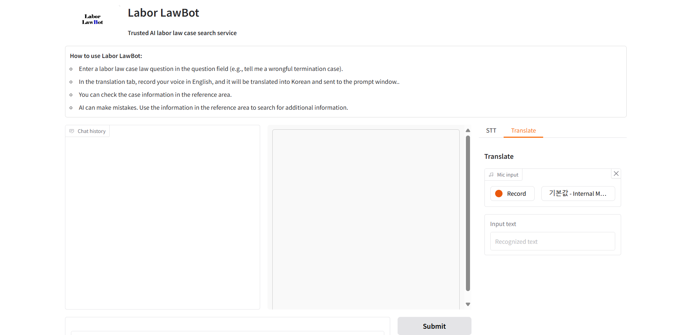
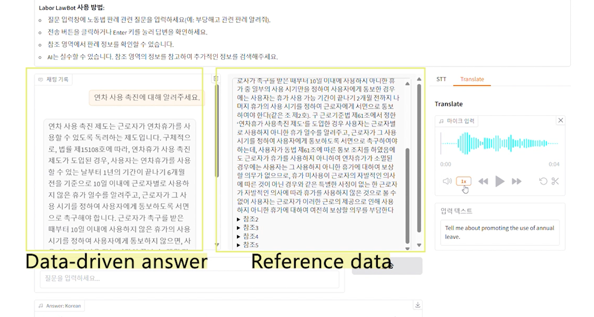
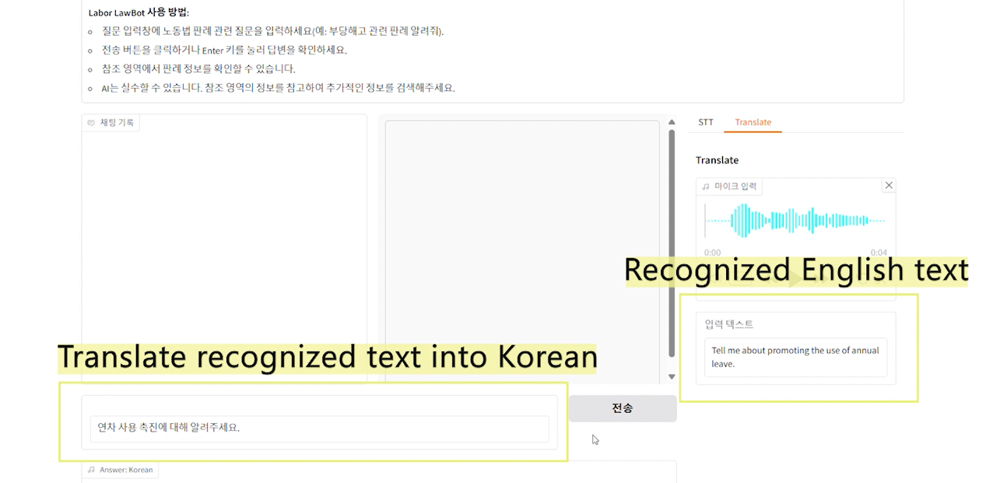

# Labor LawBot

**Labor LawBot** is an AI-powered chatbot designed to assist users in exploring labor law cases and understanding related regulations. The service utilizes Retrieval-Augmented Generation (RAG) to enhance reliability by searching a curated database of labor law cases and regulations connected to GPT, ensuring more trustworthy and accurate responses. Additionally, it leverages Azure Cognitive Services for speech-to-text (STT), text-to-speech (TTS), and translation, making it accessible and easy to use for a diverse audience.<br>
  <br>

## Features

- **Chatbot for Labor Law Queries**: Answer labor law-related questions with case references using GPT.
- **Speech-to-Text (STT)**: Convert audio input to text via Azure Speech services.
- **Text-to-Speech (TTS)**: Generate audio responses for user queries.
- **Translation**: Translate spoken English into Korean to enable queries in Korean for retrieving case results.
- **Citation Integration**: Provide detailed case references using Azure AI Search.<br>
  <br>


## Technologies Used

- **Azure AI Search**: Indexing and searching case data for efficient retrieval.
- **Azure Cognitive Services**: STT, TTS, and translation services.
- **Azure Open AI**: Custom GPT model connected to case data.
- **Gradio**: Interactive user interface for seamless interaction.
- **Python**: Backend logic and integration.

## Usage
1. Chatbot: Enter a labor law-related question and receive AI-generated answers with case citations.
2. Speech-to-Text (STT): Record audio and convert it to text for processing.
3. Text-to-Speech (TTS): Convert text responses to audio for enhanced accessibility.
4. Translation: Translate English audio inputs into Korean for bilingual support.<br>
  <br>


## File Structure
```
labor-lawbot/
│
├── main.py               # Entry point for the Gradio interface
├── stt_tts.py            # Speech-to-text and text-to-speech logic
├── gpt.py                # GPT and Azure Search integration
├── styles.css            # Custom CSS for the Gradio interface
├── requirements.txt      # Python dependencies
├── .env                  # Environment variables (not included in the repo)
├── README.md             # Project documentation
```
